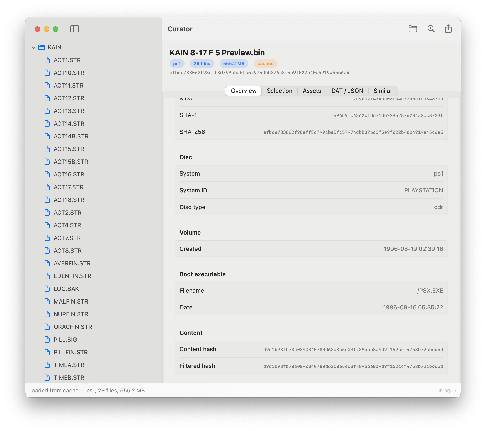
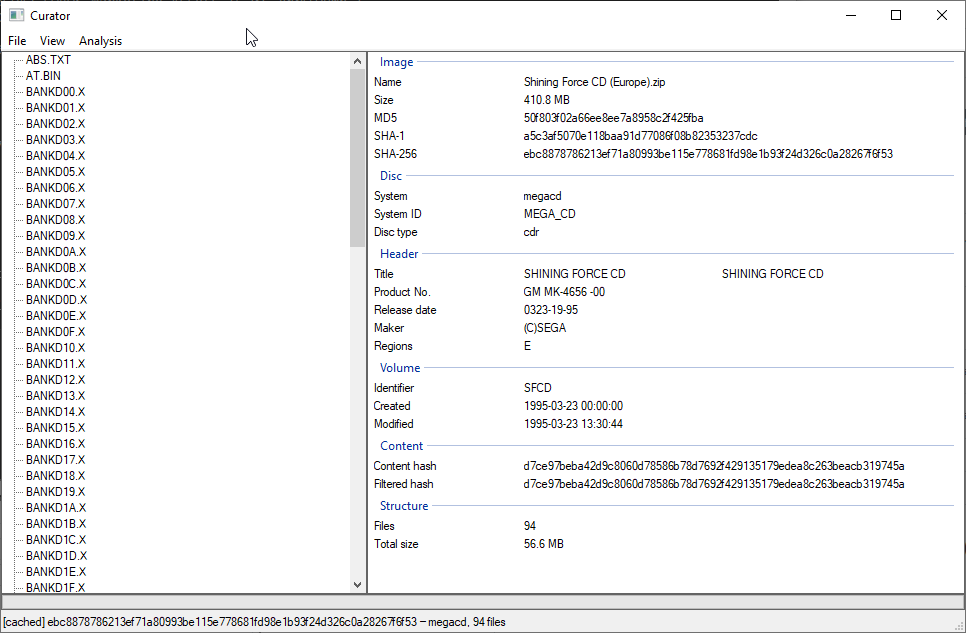

# Curator

Curator analyzes disc images and ROMs for game preservation. 

Curator can:
* Analyze disc images from 15+ systems (PS1-PS3, PSP, Saturn, Dreamcast,
  Sega CD, GameCube, Wii, Xbox, Xbox 360, CD-i, 3DO, CD32, PC), including
  archives, multi-track folder dumps, and nested containers
* Extract build dates, executables, serials, and per-file hashes into
  Redump-style DAT and JSON
* Keep a searchable local build library, cached by content hash
* Find similar builds via data, audio, and executable fingerprints
* Extract audio, video, image, document, text, and source-code assets
* Submit builds to a web library with search, in-browser asset viewing,
  and similar-build discovery.

<p>
  
  
</p>

# Dev

## Layout

```
crates/curator-core/     Rust engine: schema, adapter driver, fingerprints, cache, SQLite, DAT/JSON
crates/curator-cli/      command-line interface
crates/curator-ffi/      UniFFI bridge over the core, used by the native GUIs
crates/curator-gui-win/  Windows GUI (windows-rs)
macos/                   macOS GUI (SwiftUI)
ps2exe-adapter/          Python adapter: runs ps2exe, emits canonical JSON + progress
web/                     Next.js + Postgres listing and similarity service
lib/ps2exe/              ps2exe engine (submodule)
```

## CLI

Requires Rust, [uv](https://docs.astral.sh/uv/), and checked-out submodules
(`git submodule update --init`).

```sh
cd ps2exe-adapter && uv sync && cd ..    # one-time adapter setup

cargo run -p curator-cli -- --adapter-dir "$PWD/ps2exe-adapter" analyze image.bin
cargo run -p curator-cli -- --adapter-dir "$PWD/ps2exe-adapter" analyze image.bin -f json -o out.json
cargo run -p curator-cli -- stats
cargo run -p curator-cli -- export -o builds.jsonl   # feed for web/scripts/ingest.ts
```

Results are cached by content sha256; the cache and library live in the platform
user-data directory (`--data-dir` overrides).

## Tests

```sh
cargo test --workspace
cd web && npm test
cd ps2exe-adapter && uv run --with pytest pytest tests/
```

CI runs all of the above plus the Windows and macOS app builds.

## Packaging

The adapter freezes into a single self-contained binary, so shipped apps don't
need Python:

```sh
cd ps2exe-adapter && uv run --group dev pyinstaller curator-adapter.spec
curator --adapter-bin dist/curator-adapter analyze image.bin
```

The GUIs embed this binary; CI publishes the Windows `.exe` and macOS `.app` on
every push.

## Linux servers

`scripts/bootstrap-linux.sh` sets up rustup and uv in `$HOME` (no root) and builds
the CLI; the only system dependency is libarchive. `scripts/curator-build-set.sh`
analyzes whole dump-set directories in parallel and exports an ingestable feed:

```sh
scripts/curator-build-set.sh analyze --bin target/release/curator \
  --adapter ps2exe-adapter --lib ~/curator-lib/main --jobs 6 -- /path/to/dumps
scripts/curator-build-set.sh export --bin target/release/curator \
  --lib ~/curator-lib/main --out feed.jsonl
```

## Authors
* [Hidden Palace](https://hiddenpalace.org/) (Sazpaimon, ehw, drx)
* Contributors: [travistyoj](https://github.com/travistyoj)